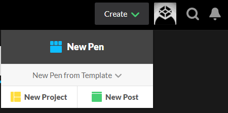
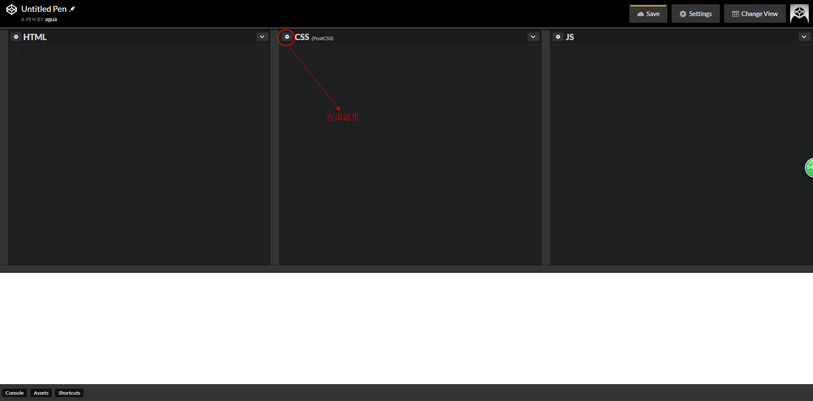
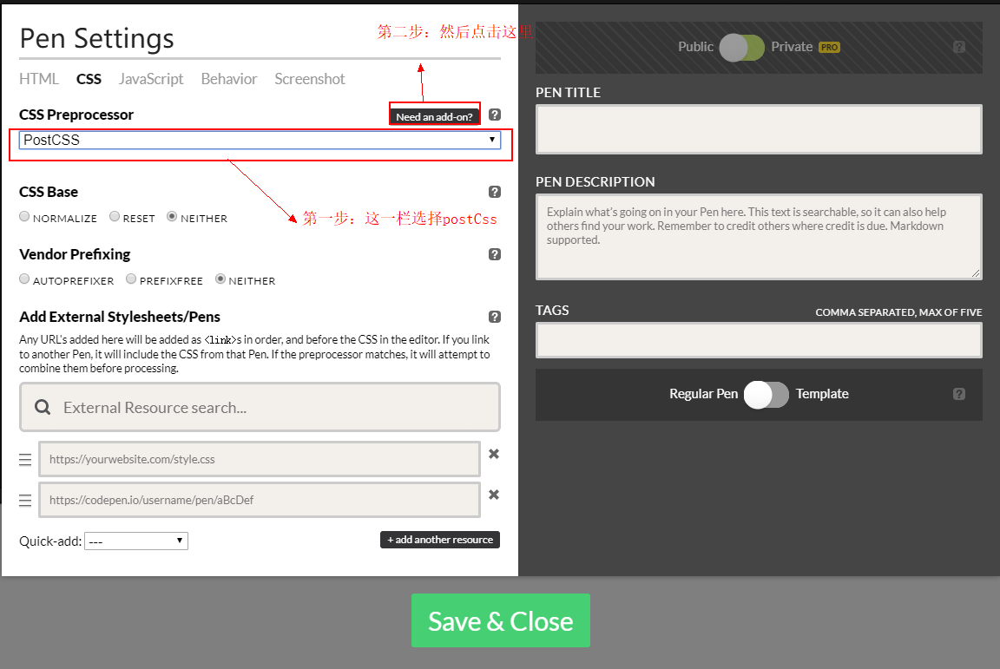
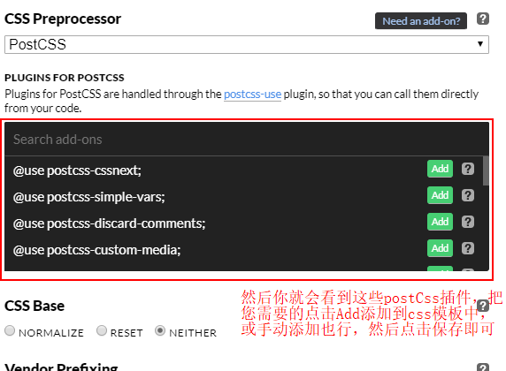
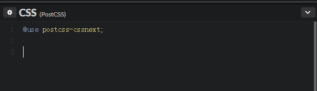

# postCss开始学习

开始学习之前，我们得有一个编译的工具，当然您可以结合postCss和gulp，或webpack，或grunt搭建一个编译环境。这里我们就不做介绍，您可以在官网找到教程。

在Kezz Bracey大神的postCss入门指南教程中，推荐了两个在线编辑工具，我选择一个作为我们的学习练习工具。

## [CodePen](https://codepen.io/)

1. 首先登陆codepen网站，注册登陆账号。
2. 创建一个newpen

3. 创建完成后，你会看到三个面板，点击css面板左上角的设置

4. 在设置中选择postCss

5. 添加你要的postCss插件

6. 看到这就是成功了，现在可以开始学习postCss插件了

## 参考文献

[PostCSS Quickstart Guide: Instant Setup Options](https://webdesign.tutsplus.com/tutorials/postcss-quickstart-guide-instant-setup-options--cms-24536)